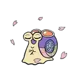

#  Clank Clank Mushi

Welcome, Senpai! Mushi is here to be your personal AI companion for the vast and wonderful world of anime. This app is more than just a streaming site; it's a smart, context-aware platform designed to enhance your anime journey by bringing news, data, and intelligent chat to your fingertips.

This project is a full-stack anime platform featuring an AI chat assistant powered by a local RAG pipeline, dynamic data ingestion and visualization, and a modern streaming interface.

<br clear="right"/>

## ✨ Core Features 

Clank Clank Mushi combines a smooth anime discovery and watching experience with a powerful, custom-built AI brain.

* **📺 Modern Anime Streaming:** Watch your favorite anime with a clean, modern player. Easily switch between servers and track your episodes.

* **🧠 The Whispering Snail (Mushi AI Chat):** The heart of the app! Click the Mushi snail floating on the screen to open a chat window. Ask Mushi anything about anime, get summaries of series, explore complex lore, or even have it suggest what to watch next.

* **⚡ RAG-Powered Context:** Mushi isn't just a generic chatbot. It uses a custom **Retrieval-Augmented Generation (RAG)** pipeline. When you ask a question, it first searches its own dedicated knowledge base to find relevant context before generating an answer. This makes its responses incredibly accurate and specialized for anime topics.

* **🔍 Smart Search & Discovery:** Find anime with a powerful search that includes live suggestions. Use the advanced filter panel to drill down by genre, type, score, status, and more.

* **📊 Interactive Data Insights:** Ever wondered how different anime are connected? The "Data Insights" page provides a 2D visualization of Mushi's entire knowledge base, clustering related topics together. It's a visual map of the anime universe!

* **🔐 Admin Control Panel:** A secure admin area allows for manual data ingestion and management, giving you full control over Mushi's knowledge.

## 🚀 Getting Started 

Ready to power up your own Mushi? Follow these steps to get the application running on your local machine.

### Prerequisites

Make sure you have these installed on your system:

* [Git](https://git-scm.com/)
* [Python](https://www.python.org/downloads/) (v3.9 or higher recommended)
* [Node.js](https://nodejs.org/en) (v18 or higher recommended)
* [Ollama](https://ollama.com/): **This is essential for the AI.** It runs large language models locally on your machine.
* A package manager for Node.js like `pnpm` or `npm`. This guide uses `pnpm`.

### 1. Ollama AI Setup

Before launching the app, you need to give Mushi its brain. Open your terminal and run the following command to download the model that powers Mushi's knowledge embedding:

```bash
ollama pull snowflake-arctic-embed:latest
```

(This model converts anime data into a format the AI can understand. The app will fail to build its database without it! The app will also automatically pull a qwen2 model for chat when you first run it).

### 2. Backend Setup 

The backend is a Python Flask server that handles the AI, data, and API requests.

```bash
# 1. Clone the repository
git clone https://github.com/LatchyCat/Clank_Clank_Mushi.git
cd Clank_Clank_Mushi

# 2. Navigate to the backend directory
cd backend

# 3. Set up a Python virtual environment
python3 -m venv venv
source venv/bin/activate  # On Windows, use `venv\Scripts\activate`

# 4. Install the required Python packages
pip install -r requirements.txt

# 5. Create your environment file (if you want to use the optional Gemini LLM)
# If you don't have a Gemini key, you can skip this step. The app defaults to local Ollama.
cp .env.example .env
# now open .env and add your key: GEMINI_KEY="YOUR_API_KEY_HERE"

# 6. !!! CRITICAL STEP: Build the Knowledge Base !!!
# This script ingests data, creates vector embeddings, and caches them.
# This one-time setup is REQUIRED before the first run.
python3 build_database.py

# 7. Run the Flask backend server
python3 app.py
```

Your backend should now be running on http://127.0.0.1:8001. You'll see log messages indicating that it's ready!

### 3. Frontend Setup 

The frontend is a modern React application built with Vite.

```bash
# 1. In a NEW terminal, navigate to the frontend directory from the project root
cd Clank_Clank_Mushi/mushi-frontend

# 2. Install the required Node.js packages
pnpm install

# 3. Run the Vite development server
pnpm dev
```

Your frontend should now be running! Open your web browser to http://localhost:5173 to use the app.

## 🛠 How It Works: The Mushi Architecture 

The application is a monorepo composed of a Python backend and a React frontend.

### Mushi Frontend (React + Vite):
* This is the user interface you interact with in the browser.
* Built with React, it provides a dynamic and responsive user experience.
* Vite serves the application with an incredibly fast development server and optimized production builds.
* React Router handles all the client-side navigation, making the app feel snappy.
* Artplayer and HLS.js are used to create the robust video streaming experience.
* The entire UI is styled with Tailwind CSS, making it modern and easy to maintain.

### Mushi Backend (Python + Flask):
* The backend is a lightweight Flask server that acts as the application's central nervous system.
* It contains the crucial video Proxy & Decryption logic which securely fetches and decodes video stream URLs from external sources, making them playable.
* Cloudscraper and Beautiful Soup are used to scrape anime information from various web sources.

### The Mushi "Brain" (AI & Data Layer):
* **Ollama Integration:** The AI Chat is powered by local LLMs running on Ollama. This ensures privacy and zero API costs for the core chat functionality.
* **Vector Database & RAG:** At its core, Mushi uses a faiss-cpu powered VectorStore. The DataEmbeddingService takes all scraped anime information, converts it into numerical representations (embeddings) using the snowflake-arctic-embed model, and stores them. This Retrieval-Augmented Generation process makes the AI an anime expert.
* **Data Visualization:** The Data Insights page uses K-Means clustering (scikit-learn) on the vector data to group similar anime and topics. The results are visualized in the browser using D3.js.

## 💻 Tech Stack & Libraries 

This project stands on the shoulders of many amazing open-source libraries and frameworks.

### Backend

| Technology | Purpose & Impact |
|------------|------------------|
| **Python** | The primary language for the backend, chosen for its powerful data science and web development ecosystems. |
| **Flask** | A lightweight and flexible web framework for building the API endpoints. Perfect for creating a modular and scalable backend. |
| **Ollama** | Allows running powerful open-source LLMs locally, forming the core of Mushi's chat and RAG system while ensuring privacy and no API costs. |
| **Faiss (faiss-cpu)** | A high-performance library from Meta AI for efficient similarity search. It powers our vector database, making RAG lookups incredibly fast. |
| **Scikit-learn** | Used for its K-Means algorithm to perform the clustering for the Data Insights visualization. |
| **google-generativeai** | For optional integration with Google's Gemini models. |
| **cloudscraper & beautifulsoup4** | For bypassing anti-bot measures and parsing HTML. |
| **pycryptodome** | Essential for the AES decryption logic required to handle video stream URLs. |

### Frontend

| Technology | Purpose & Impact |
|------------|------------------|
| **React** | The core UI library for building a component-based, interactive single-page application. |
| **Vite** | A next-generation frontend tool providing an incredibly fast development server and optimized builds. |
| **Tailwind CSS** | A utility-first CSS framework that allows for rapid UI development and a highly maintainable design system. |
| **Artplayer.js / HLS.js** | Powers the modern video player, with HLS.js providing the capability to play adaptive m3u8 video streams. |
| **LLM-UI / @llm-ui/react** | A fantastic library providing the core components for building the sleek, streaming chat interface used by Mushi AI. |
| **axios** | For making API calls to the backend. |
| **swiper** | Used for creating touch-friendly, responsive carousels. |
| **d3 & react-chartjs-2** | Used to render the interactive 2D scatter plot for the Data Insights page. |
| **lucide-react** | Provides a beautiful and consistent set of icons used throughout the application. |

## 🙏 Acknowledgements & Inspirations 

This project wouldn't be possible without the amazing work of the open-source community and other developers. Special thanks and credit to:

* **LLM-UI** ([github](https://github.com/llm-ui-kit/llm-ui), [website](https://llm-ui.com/)) – The foundation of the chat interface.
* **The Consumet API / anify** ([github](https://github.com/consumet/consumet.ts)) – An invaluable reference for data source and decryption logic.
* **ibelick** ([website](https://ui.ibelick.com/)) – For the stunning animated grid background inspiration.
* The creators and maintainers of all the libraries and frameworks listed in the tech stack.

---

<div align="center">

**Made with 💖 by LatchyCat**

<br><br>


&nbsp;&nbsp;

&nbsp;&nbsp;

&nbsp;&nbsp;


</div>
